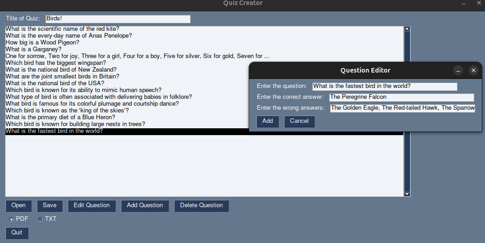

# QuizMasterPaper

QuizMasterPaper is a simple GUI-based quiz creator application to export the quizzes in either PDF or TXT formats for printing. Quizzes from other QuizMaster applications are an acceptable format. 



## Installation

1. Clone this repository via terminal ```git clone https://github.com/oxcobu/QuizMasterPaper```
2. Enter the directory containing the game executable: ```cd QuizMasterPaper```
3. Set up a new virtual environment: ```python3 -m venv venv```
4. Activate the environment: ```source venv/bin/activate``` (To decativate, type `deactivate`)
5. Install tkinter: ```sudo apt-get install python3-tk```
6. Install packages in `requirements.txt`: ```pip3 install -r requirements.txt```

*Steps 3 and 4 are optional but recommended.*


## Usage

1. Run the Application: Start the application by running the script:
```sh
    python3 quizcreator.py
```
2. Create a New Quiz:
 Enter the title of the quiz in the "Title of Quiz" field.
 Add questions using the "Add Question" button.
 Fill in the question, the correct answer, and wrong answers when prompted.
 Repeat this process to add multiple questions.

3. Edit Questions:
    Select a question from the list.
    Click "Edit Question" to modify the selected question.

4. Delete Questions:
    Select a question and click "Delete Question" to remove it from the list.

5. Save the Quiz:
    Choose a format (PDF or TXT) using the radio buttons.
    Click "Save" to export your quiz.

6. Open an Existing Quiz:
    Click "Open" to browse and load a quiz from a JSON file.

### Features

- Create and manage quiz questions.
- Add correct and wrong answers for each question.
- Edit existing questions.
- Delete questions from the quiz.
- Save quizzes as PDF or TXT files.
- Load existing quizzes from JSON files.

## Future work

- More saving formats
- More flexible layout
